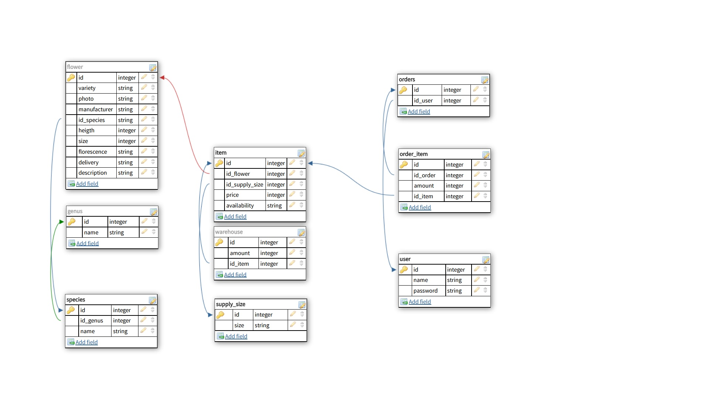
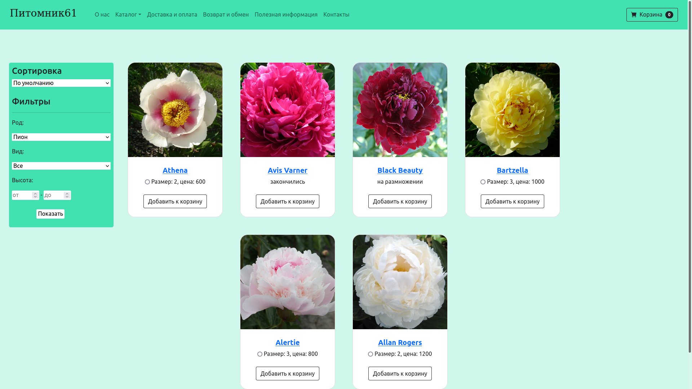

# Flowers shop
Онлайн магазин для продажи посадочного материала различных видов цветов с доставкой, в каталоге реализована сортировка по названию, цене. 
Можно установить фильтры на цену, вид, высоту растений
___________
## Стек 
- Python 
- Django
- PostgreSQL 
- HTML
- Bootstrap
_____
## Инструкция по запуску
- склонировать проект на свой компьютер
- ``pip install -r requirements.txt``
- создать базу данных `django_db` в PostgreSQL
- ``python manage.py migrate``

- ``python manage.py runserver``
----
## Схема БД

## Скриншот интернет магазина

